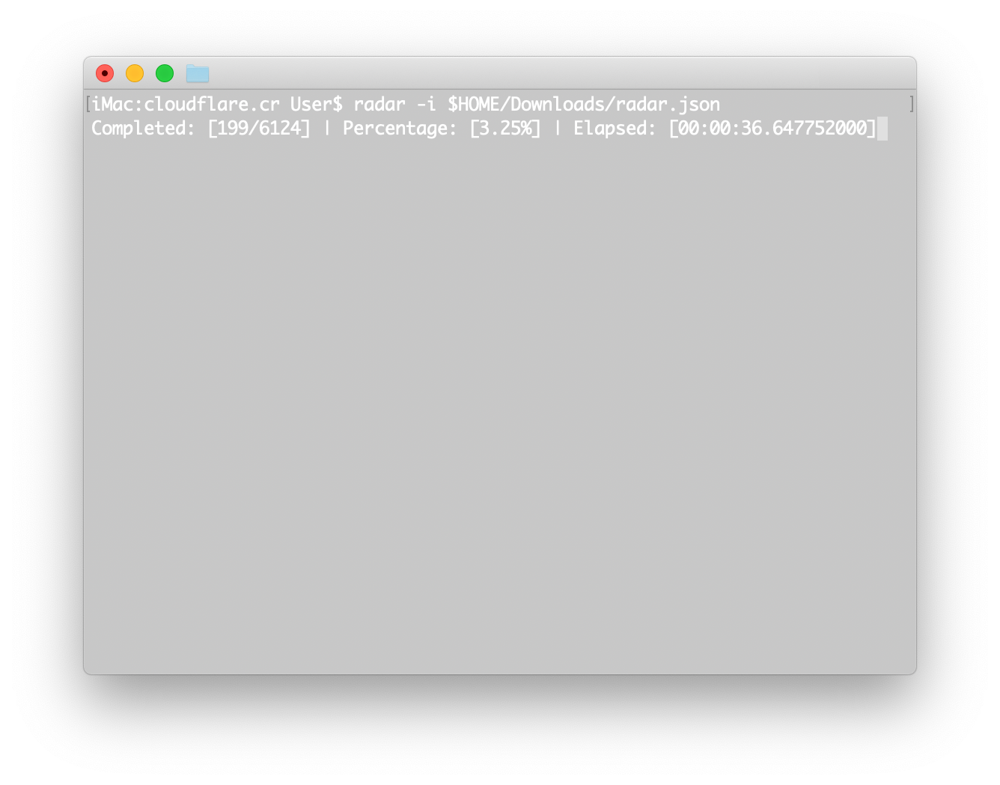

<div align = "center"></div>

<div align = "center">
  <h1>Cloudflare.cr - Cloudflare Radar and Booster</h1>
</div>

<p align="center">
  <a href="https://crystal-lang.org">
    </a>
  <a href="https://github.com/636f7374/cloudflare.cr/actions">
    </a>
  <a href="https://github.com/636f7374/cloudflare.cr/releases">
    </a>
  <a href="https://github.com/636f7374/cloudflare.cr/blob/master/license">
    </a>
</p>

<div align = "center"><a href="#"></a></div>

## Description

* High-performance, reliable, and stable Cloudflare Edge Radar and Booster.
* This repository is under evaluation and will replace [Coffee.cr](https://github.com/636f7374/coffee.cr).
* More description to be added.

## Features

* [X] Radar
* [X] Scanner

## Usage

* Please check the examples folder.

### Radar

* Radar Configuration File (Standard Concurrent).

```yaml
---
outputPath: $HOME/output.yml
concurrentCount: 230
scanIpAddressType: ipv4_only
numberOfScansPerIpBlock: 50
maximumNumberOfFailuresPerIpBlock: 15
skipRange:
  - 2
  - 4
excludes:
  - - LosAngeles_UnitedStates
  - - SanJose_UnitedStates
  - - LosAngeles_UnitedStates
    - SanJose_UnitedStates
endpoint:
  port: 80
  method: GET
  path: /__down?bytes=64
  headers:
    - User-Agent: "Mozilla/5.0 (Windows NT 6.1; WOW64) AppleWebKit/534.50 (KHTML, like Gecko) Version/5.1 Safari/534.50"
      Accept: "text/html,application/xhtml+xml,application/xml;q=0.9,image/webp,*/*;q=0.8"
      Accept-Language: "en-US,en;q=0.5"
      Connection: "keep-alive"
      Host: "speed.cloudflare.com:80"
      Upgrade-Insecure-Requests: "1"
timeout:
  read: 2
  write: 2
  connect: 2
```

* Radar Configuration File (Concurrent + SubProcess Parallel).

```yaml
---
outputPath: $HOME/output.yml
concurrentCount: 230
scanIpAddressType: ipv4_only
numberOfScansPerIpBlock: 50
maximumNumberOfFailuresPerIpBlock: 15
skipRange:
  - 2
  - 4
excludes:
  - - LosAngeles_UnitedStates
  - - SanJose_UnitedStates
  - - LosAngeles_UnitedStates
    - SanJose_UnitedStates
endpoint:
  port: 80
  method: GET
  path: /__down?bytes=64
  headers:
    - User-Agent: "Mozilla/5.0 (Windows NT 6.1; WOW64) AppleWebKit/534.50 (KHTML, like Gecko) Version/5.1 Safari/534.50"
      Accept: "text/html,application/xhtml+xml,application/xml;q=0.9,image/webp,*/*;q=0.8"
      Accept-Language: "en-US,en;q=0.5"
      Connection: "keep-alive"
      Host: "speed.cloudflare.com:80"
      Upgrade-Insecure-Requests: "1"
parallel:
  executableName: cloudflare
  calleeCount: 4
  listenAddress: tcp://0.0.0.0:4832
  type: sub_process
timeout:
  read: 2
  write: 2
  connect: 2
```

* Radar Configuration File (Concurrent + Distributed Parallel).

```yaml
parallel:
  calleeCount: 4
  type: distributed
```

* Radar Configuration File (Concurrent + Hybrid (SubProcess & Distributed) Parallel).

```yaml
parallel:
  calleeCount: 4
  subProcessCalleeCount: 2
  type: hybrid
```

### Used as Shard

Add this to your application's shard.yml:

```yaml
dependencies:
  cloudflare:
    github: 636f7374/cloudflare.cr
```

### Installation

```bash
$ git clone https://github.com/636f7374/cloudflare.cr.git
$ cd cloudflare.cr && make build && make install
```

## Development

```bash
$ make test
```

## Credit

* [\_Icon - Freepik/LawAndJustice](https://www.flaticon.com/packs/law-and-justice-62)
* [Shard - Sija/ipaddress.cr](https://github.com/sija/ipaddress.cr)

## Contributors

|Name|Creator|Maintainer|Contributor|
|:---:|:---:|:---:|:---:|
|**[636f7374](https://github.com/636f7374)**|√|√|√|

## License

* GPLv3 License
